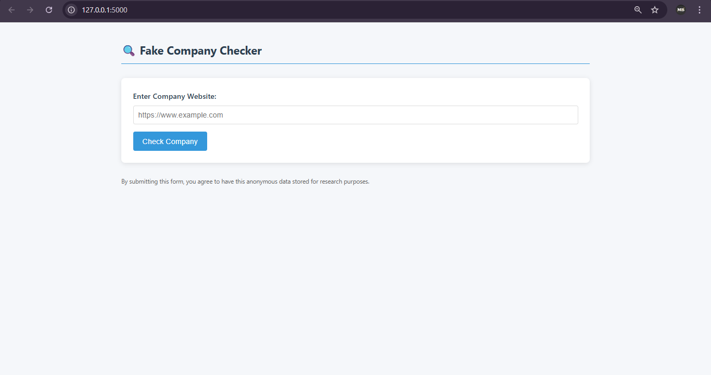
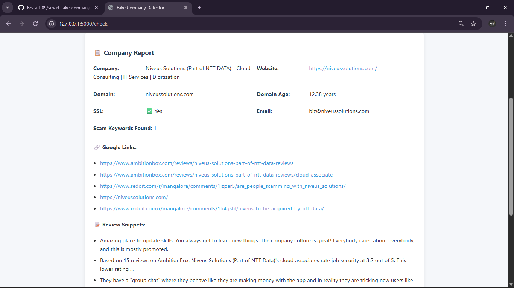
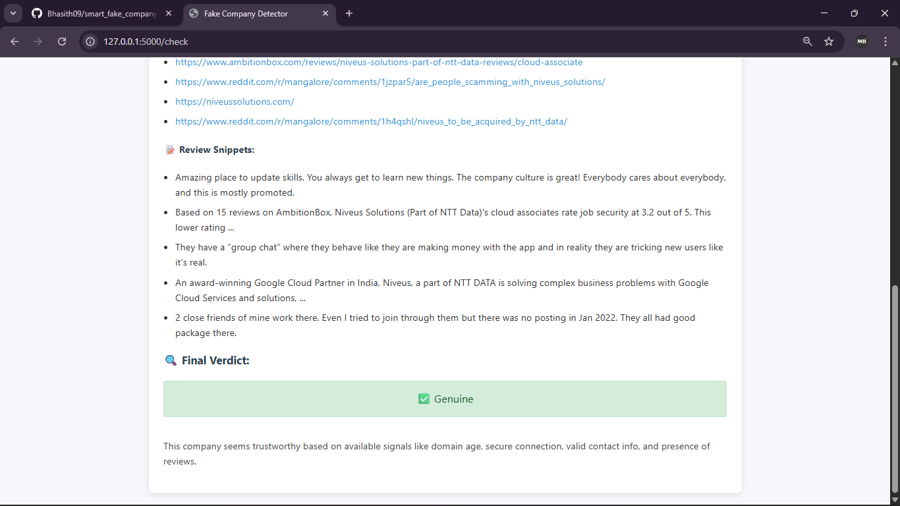
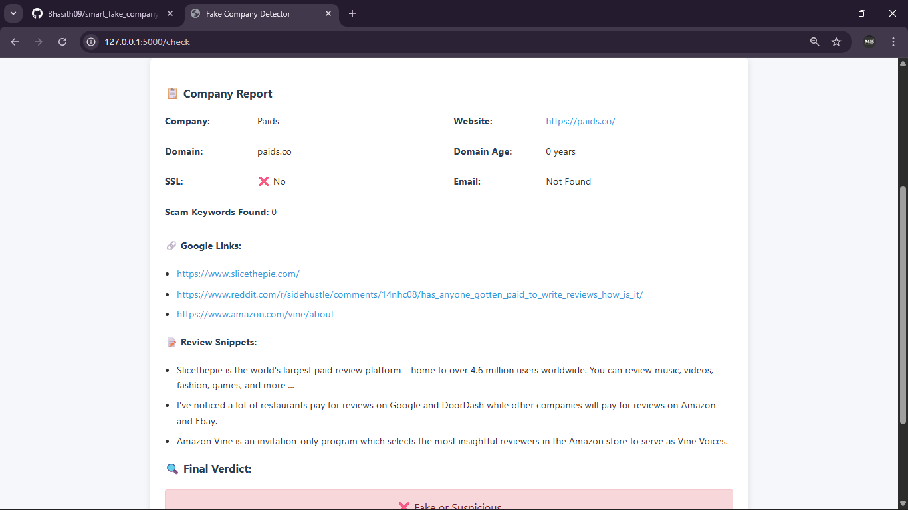
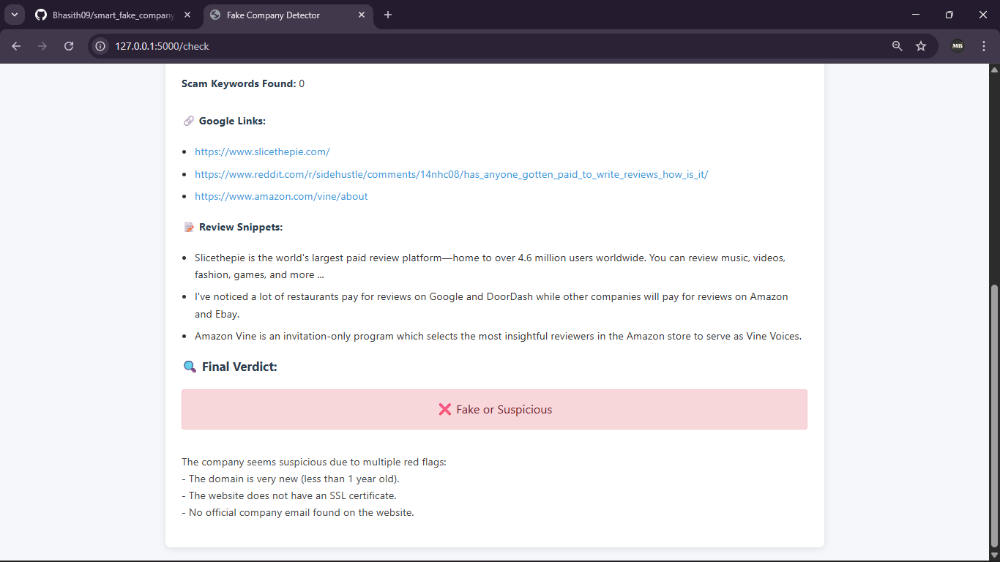

🔍 Fake Company Checker

A Flask-based web app that detects potentially fake or suspicious companies by analyzing their website’s data, domain information, and online presence.
This project helps job seekers, freelancers, and businesses avoid scams by generating a detailed trustworthiness report.

  
  

  
  

🚀 Features

🔍 Domain Analysis

* Extracts domain name and domain age using WHOIS lookup

* Checks if the website has a valid SSL certificate

🕸 Website Scraping

* Attempts to extract the official company name from meta tags, titles, and headings

* Finds official company email addresses (same domain)

* Counts scam-related keywords in website content

💬 Review Analysis

* Fetches Google review links using SerpAPI

* Collects review snippets for credibility check

⚖️ Risk Assessment

* Generates a final verdict: ✅ Genuine or ❌ Fake/Suspicious

* Provides detailed reasoning behind the verdict

📝 Data Logging

Saves all reports in company_data.csv for record keeping and analysis

🎨 User-Friendly UI

* Clean HTML/CSS design

* Loading spinner for smooth user experience

🛠️ Tech Stack

Backend:

* Python

* Flask

Frontend:

* HTML

* CSS

APIs:

SerpAPI for Google Search data

Libraries & Tools:

* requests – HTTP requests for scraping

* beautifulsoup4 – HTML parsing

* tldextract – Domain extraction

* python-whois – Domain age lookup

* ssl, socket – SSL verification

* dotenv – Secure environment variables

💡 Future Enhancements

🤖 AI-powered sentiment analysis for reviews

🌍 Multi-language support

☁️ Deploy to cloud (Heroku, Render, or Vercel)

📊 Advanced fraud scoring algorithm
